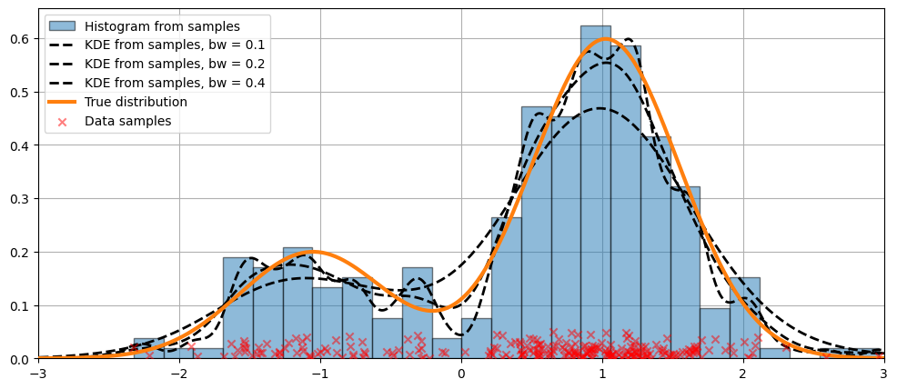

# Estimativa de densidade do kernel (KDE)

O Kernel Density Estimator (KDE) é um modelo não paramétrico que calcula a função de densidade de probabilidade (PDF) de uma variável aleatória. Em outras palavras é uma técnica que permite criar uma curva suave a partir de um conjunto de dados.

Link de estudo:

* [Kernel Density Estimator explained step by step](https://towardsdatascience.com/kernel-density-estimation-explained-step-by-step-7cc5b5bc4517)

